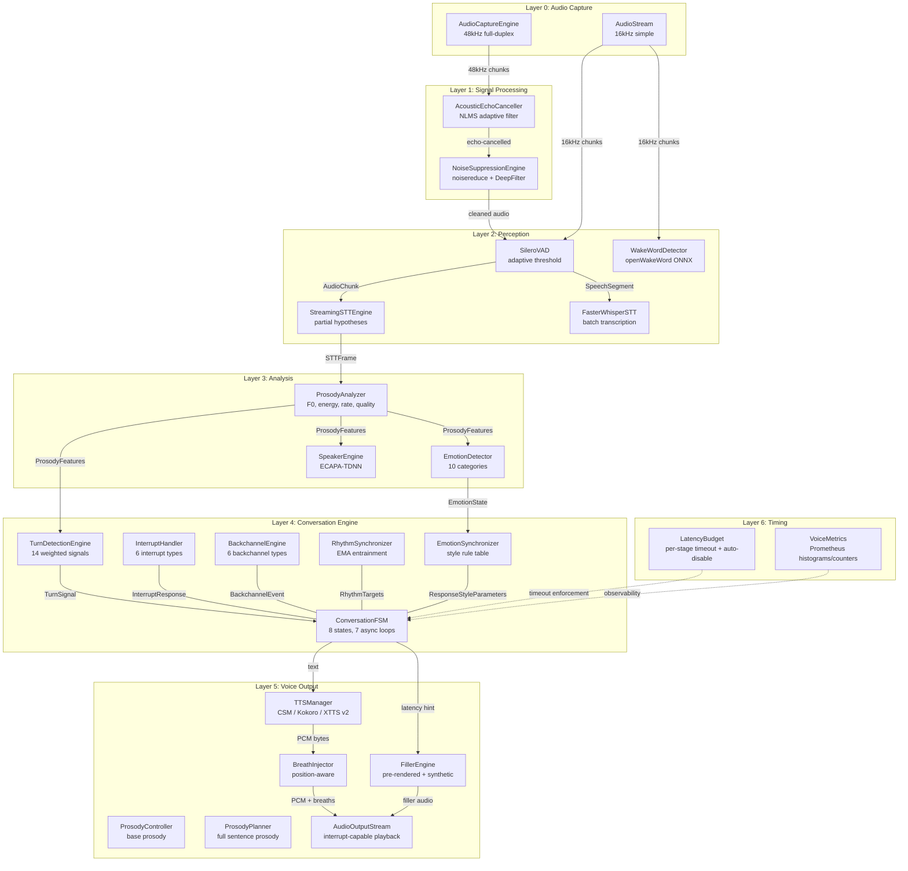
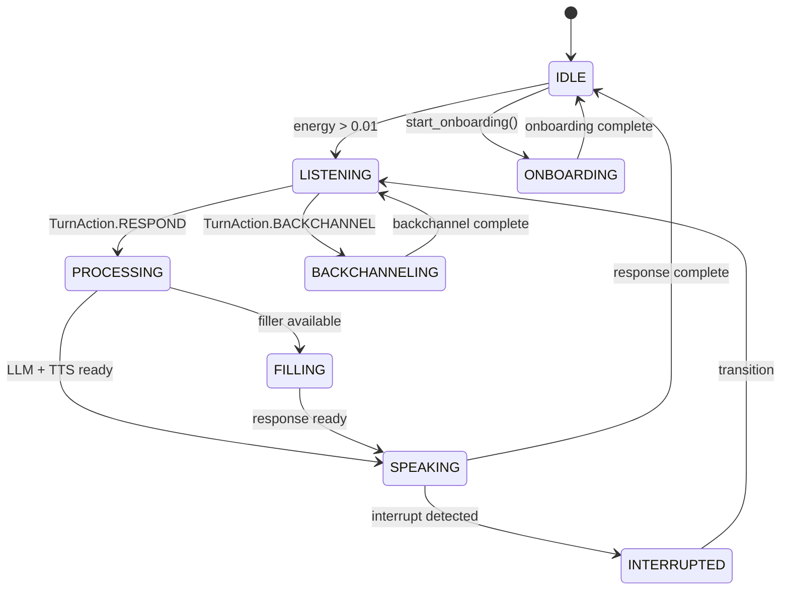

# Emily Voice Subsystem — Comprehensive Evaluation Report

**Document Version:** 1.0
**Report Date:** 2026-02-23
**Classification:** Technical / Engineering
**Scope:** Voice pipeline end-to-end: perception/audio, conversation, voice, timing

---

## Table of Contents

1. [Executive Summary](#1-executive-summary)
2. [Architecture Evaluation](#2-architecture-evaluation)
3. [Signal Flow & Data Path Analysis](#3-signal-flow--data-path-analysis)
4. [Code Quality Audit](#4-code-quality-audit)
5. [Performance Analysis](#5-performance-analysis)
6. [Latency Budget Compliance](#6-latency-budget-compliance)
7. [Test Coverage Analysis](#7-test-coverage-analysis)
8. [Security & Privacy](#8-security--privacy)
9. [Resilience & Error Handling](#9-resilience--error-handling)
10. [Feature Completeness Matrix](#10-feature-completeness-matrix)
11. [Prioritized Recommendations](#11-prioritized-recommendations)
12. [Appendix](#12-appendix)

---

## 1. Executive Summary

### 1.1 Scope of Evaluation

This report evaluates **29 source files across 4 packages** totaling **~7,660 lines of Python** that compose Emily's voice subsystem, plus **9 test files** (~2,412 lines) covering voice-related functionality.

| Package | Files | Lines | Purpose |
|---------|-------|-------|---------|
| `perception/audio/` | 13 | ~3,000 | Capture, VAD, STT, wake word, AEC, noise suppression, prosody, emotion, speaker ID |
| `conversation/` | 8 | ~2,830 | FSM, voice engine, turn detection, interrupts, backchannels, rhythm, emotion sync |
| `voice/` | 8 | ~1,490 | TTS engines, prosody control, fillers, breath injection, output stream, singing |
| `timing/` | 3 | ~340 | Latency budgets, per-stage timing metrics |
| **Total** | **32** | **~7,660** | |

### 1.2 Subsystem Maturity Assessment

Each subsystem is scored from 1 (prototype) to 5 (production-ready).

| Subsystem | Score | Assessment |
|-----------|-------|------------|
| Audio Capture | 3.5 | Two implementations (simple + full-duplex), both functional but architecturally duplicated. Full-duplex capture has custom ring buffer, real-time thread priority, silence fallback. |
| Wake Word Detection | 3.0 | openWakeWord with ONNX, pre-roll buffer, cooldown debounce. Stub fallback when library missing. No custom model training pipeline. |
| Voice Activity Detection | 4.0 | Silero VAD v5 with adaptive noise floor, energy-based fallback, hysteresis state machine. Well-engineered. |
| Speech-to-Text (Batch) | 4.0 | Faster-Whisper large-v3-turbo with CUDA float16, word timestamps, confidence scoring. Solid. |
| Speech-to-Text (Streaming) | 3.5 | Sliding window with speculative/committed word tracking. Placeholder resampler (np.interp). |
| Acoustic Echo Cancellation | 2.0 | NLMS algorithm implemented but per-sample Python loop is ~100x too slow for real-time at 48kHz. |
| Noise Suppression | 3.5 | Two-stage pipeline (noisereduce + DeepFilterNet) with SNR-gated GPU activation and speech feature protection. |
| Prosody Analysis | 3.5 | F0 extraction (Praat + autocorrelation fallback), energy, trajectory, voice quality, speaking rate. Per-speaker baselines. |
| Emotion Detection | 3.0 | 10-category heuristic classifier from prosody deltas + lexical cues. EMA smoothing. No ML model. |
| Speaker Identification | 2.5 | ECAPA-TDNN embedder works; pyannote diarizer loaded but never called. Hardcoded CUDA device. |
| Turn Detection | 4.5 | 14-signal weighted fusion engine. No hard-coded silence timers. Linguistically informed. Best-in-class within this codebase. |
| Interruption Handling | 4.0 | 6-type classification, graceful audio stop at word boundaries, context preservation with TTL, resumption. |
| Backchannel Engine | 3.5 | 6 types, pre-recorded WAV with synthesized fallback, rate limiting, phrase boundary safety check. |
| Rhythm Synchronization | 3.5 | EMA entrainment, cross-session export/import defined but never wired. |
| Emotion Synchronization | 3.0 | Style rule table (10 emotions x 7 params), confidence scaling, cognitive load adaptation. LLM style instructions defined but never integrated. |
| TTS Engine Manager | 4.0 | Strategy pattern with 3 engines (CSM, Kokoro, XTTS v2), automatic fallback chain, prosody integration, async streaming. |
| Filler Engine | 3.0 | Pre-rendered + synthetic fillers with category routing. Unused parameters. Cooldown constant defined but unused. |
| Breath Injection | 3.0 | Position-aware with jittered intervals, synthetic + pre-recorded. Silent error swallowing in load(). |
| Audio Output Stream | 3.5 | Producer-consumer with interrupt support, format sniffing (WAV/MP3/PCM), volume normalization. MP3 path buffers fully before decode. |
| Singing | 3.5 | Three engines (MusicGen, RVC, Suno), identical pattern to TTS. Fully implemented. |
| Conversation FSM | 4.0 | 8 states, 7 concurrent 100Hz async loops, dependency injection, observer pattern, speculative generation. 1,003 lines in single file. |
| Voice Engine (bootstrap) | 3.0 | ~180-line factory, feature flags, fast mode. Incomplete teardown (stops 3 of 15+ modules). |
| Latency Budget | 4.0 | Per-stage timeout enforcement, auto-disable on 3 consecutive violations within 60s, P50/P95/P99 reporting. |
| Timing Metrics | 4.0 | 9 Prometheus metrics (histograms, counters, gauges) with no-op fallback when prometheus_client is unavailable. |

**Weighted Average: 3.4 / 5.0** — The voice subsystem is architecturally ambitious and feature-rich but has critical performance blockers (AEC), significant test gaps (14 untested modules), and integration seams that prevent full-pipeline operation.

### 1.3 Critical Risk Matrix

| Risk | Severity | Likelihood | Impact | Status |
|------|----------|------------|--------|--------|
| AEC too slow for real-time | Critical | Certain | Voice pipeline cannot run with echo cancellation | OPEN |
| No voice pipeline benchmarks | High | Certain | Cannot verify latency budget compliance | OPEN |
| 14 modules with zero test coverage | High | Likely | Regressions in core audio path go undetected | OPEN |
| VoiceEngine stops 3/15+ modules | High | Likely | Resource leaks on shutdown | OPEN |
| Unbounded `_emotion_history` list | Medium | Likely | Memory growth over long sessions | OPEN |
| Hardcoded `device="cuda"` in SpeakerEngine | Medium | Possible | Crash on CPU-only systems | OPEN |
| Relative asset paths break outside project root | Medium | Possible | FillerEngine/BreathInjector fail to find WAVs | OPEN |
| `_onboarding_listen` timing bug | Low | Possible | Silence detection inaccurate during onboarding | OPEN |

### 1.4 Top 10 Findings by Severity

1. **AEC NLMS is 100x too slow** (aec.py:181-198) — per-sample Python loop with 4,800 taps at 48kHz.
2. **Zero voice pipeline benchmarks** — end-to-end latency is unmeasured against the 2-second target.
3. **14 critical modules have no unit tests** — STT, VAD, TTS, wake word, pipeline, output stream, and more.
4. **VoiceEngine.stop() only tears down 3 of 15+ modules** — incomplete shutdown.
5. **AEC and noise suppression are not wired into pipeline.py** — only available through the separate voice_engine.py path.
6. **Dual prosody systems** — ProsodyController (used by TTS) and ProsodyPlanner (seemingly unused in output path) overlap without clear delineation.
7. **11+ instances of dead code** — defined constants, parameters, methods, and data classes that are never used.
8. **Speaker diarizer loaded but never called** — pyannote pipeline consumes VRAM but provides no value.
9. **STT resampler uses np.interp** (no anti-aliasing) — documented as placeholder, never replaced.
10. **Unbounded `_emotion_history`** in EmotionSynchronizer — grows forever without trimming.

---

## 2. Architecture Evaluation

### 2.1 High-Level Architecture

Emily's voice subsystem follows a **hub-and-spoke architecture** with the `ConversationFSM` as the central coordinator (hub) and specialized engines as spokes. The `VoiceEngine` class serves as a factory/bootstrap that assembles all components and injects them into the FSM.



### 2.2 Architectural Strengths

1. **Consistent abstractions.** Both `TTSEngine` and `SingingEngineBase` use identical Strategy + Fallback Chain patterns. All engines produce uniform int16 PCM at 24 kHz.

2. **Graceful degradation.** Every ML model (Silero, Faster-Whisper, openWakeWord, SpeechBrain, pyannote, noisereduce, DeepFilterNet, Parselmouth) uses lazy imports with stub fallback. Missing a library degrades functionality but never crashes.

3. **Proper async discipline.** Blocking inference is consistently wrapped in `asyncio.to_thread()`. The FSM runs 7 concurrent loops via `asyncio.TaskGroup`. The audio capture bridges C-thread callbacks to async via `run_coroutine_threadsafe`.

4. **Sophisticated turn detection.** The 14-signal weighted fusion engine is linguistically informed (intonation, syntactic completeness, discourse markers, backchannel elicitors) rather than relying on silence timers.

5. **Structured observability.** 9 Prometheus metrics with stage-level histograms, plus structured logging (`get_logger(__name__)`) throughout all 29 files. OpenTelemetry spans on STT.

6. **Latency budget enforcement.** The `LatencyBudget` class wraps coroutines with per-stage timeouts, auto-disables stages after 3 consecutive violations within 60 seconds, and reports P50/P95/P99.

### 2.3 Architectural Concerns

**Concern 1: Two parallel capture paths**

| Path | File | Used By | Sample Rate | Features |
|------|------|---------|-------------|----------|
| Simple | `stream.py` | `pipeline.py` (legacy) | Configurable (16kHz default) | Queue-based, silence fallback |
| Full-duplex | `capture.py` | `voice_engine.py` (new engine) | 48kHz input, 24kHz output | Ring buffer, AEC reference loopback, RT priority |

The two capture paths serve different use cases but create confusion about which to use. The simple path (`pipeline.py`) lacks AEC and noise suppression; the full-duplex path (`voice_engine.py`) has them but routes through a completely different orchestrator.

**Concern 2: AEC and noise suppression not wired into pipeline.py**

`pipeline.py` goes directly `AudioStream -> WakeWord + VAD -> STT` with no signal processing. The AEC and noise suppression modules exist but are only available through the `voice_engine.py` path, meaning the legacy half-duplex pipeline operates on raw, noisy audio.

**Concern 3: Hub-and-spoke single-file coordinator**

`conversation/fsm.py` is 1,003 lines containing the `ConversationFSM` class with 22+ methods and 7 concurrent async loops. While the hub-and-spoke pattern is sound, the file is oversized. Key loops (`_response_loop` at 116 lines, `_turn_detection_loop` at 77 lines) could be extracted into separate coordinator modules.

**Concern 4: Dual prosody systems**

| System | File | Used By | Approach |
|--------|------|---------|----------|
| `ProsodyController` | `voice/prosody.py` | `TTSManager.speak()` | Rule-based from emotional state |
| `ProsodyPlanner` | `voice/prosody_planner.py` | Unclear — not directly called by FSM or TTS | Full sentence-level planning with position awareness |

Both systems compute prosody parameters, but `ProsodyPlanner` appears to be an evolution of `ProsodyController` that was never fully integrated. The planner has richer features (terminal contour, emphasis words, sentence-position awareness) but is not wired into the main TTS output path.

### 2.4 Module Dependency Graph

```mermaid
flowchart TD
    VE["VoiceEngine\n(bootstrap)"]
    FSM_node["ConversationFSM\n(coordinator)"]
    VE --> FSM_node

    FSM_node --> TurnDet["TurnDetectionEngine"]
    FSM_node --> BC["BackchannelEngine"]
    FSM_node --> Interrupt["InterruptHandler"]
    FSM_node --> Rhythm["RhythmSynchronizer"]
    FSM_node --> EmotionSync["EmotionSynchronizer"]

    FSM_node --> Capture["AudioCaptureEngine"]
    FSM_node --> StreamSTT["StreamingSTTEngine"]
    FSM_node --> ProsodyA["ProsodyAnalyzer"]
    FSM_node --> EmotionD["EmotionDetector"]
    FSM_node --> SpeakerE["SpeakerEngine"]
    FSM_node --> AEC_node["AcousticEchoCanceller"]
    FSM_node --> Noise["NoiseSuppressionEngine"]

    FSM_node --> LLMOrch["ConversationLLMOrchestrator"]
    FSM_node --> TTSMgr["TTSManager"]
    FSM_node --> FillerE["FillerEngine"]
    FSM_node --> BreathI["BreathInjector"]
    FSM_node --> LatBudget["LatencyBudget"]
```



The FSM directly holds references to 17 modules injected via `configure(**modules)`. All modules are optional (None-checked before use), enabling fast-mode operation where costly modules like speaker tracking and emotion detection are skipped.

---

## 3. Signal Flow & Data Path Analysis

### 3.1 End-to-End Audio Path

The voice pipeline processes audio through 6 stages from microphone input to speaker output. Two distinct paths exist:

**Path A: Full-Duplex (voice_engine.py -> ConversationFSM)**

```
Microphone @ 48kHz
    |
    v
AudioCaptureEngine.get_input_chunk()
    | 480 samples per 10ms chunk, float32
    v
AcousticEchoCanceller.process(mic, reference)
    | Echo-cancelled audio
    v
NoiseSuppressionEngine.process(chunk, is_speech)
    | Cleaned audio (noisereduce + optional DeepFilter)
    v
downsample_48k_to_16k() via scipy.signal.decimate (factor 3)
    | 160 samples per 10ms chunk @ 16kHz
    v
StreamingSTTEngine.process_chunk()
    | STTFrame with partial_text, committed/speculative words
    v
ProsodyAnalyzer.process()
    | ProsodyFeatures (F0, energy, trajectory, rate, quality)
    v
EmotionDetector.detect() + SpeakerEngine.process_frame()
    | EmotionState + SpeakerFrame
    v
TurnDetectionEngine.compute()
    | TurnSignal (action = LISTEN / BACKCHANNEL / RESPOND)
    v
ConversationFSM state transition
    | LISTENING -> PROCESSING -> FILLING -> SPEAKING
    v
LLM response (via AgentBus or direct Orchestrator)
    |
    v
TTSManager.speak(text, emotional_state)
    | Async PCM byte stream @ 24kHz int16
    v
BreathInjector.inject() + FillerEngine blending
    |
    v
AudioOutputStream.play_stream()
    | Normalize, format-sniff, queue, play via sounddevice
    v
Speaker @ 24kHz (upsampled to 48kHz for output device)
```

**Path B: Legacy Half-Duplex (pipeline.py)**

```
Microphone @ 16kHz (AudioStream)
    |
    v
WakeWordDetector.process() -- cooldown 8s
    | wake word detected -> arm STT
    v
SileroVAD.process()
    | SpeechSegment when speech ends
    v
FasterWhisperSTT.transcribe()
    | TranscriptResult (text, words, confidence)
    v
PerceptionBus.publish("audio.transcript")
    |
    v
Bootstrap._perception_tts_bridge() listens for events
    | LLM -> TTS -> play
```

### 3.2 Sample Rate Transitions

| Stage | Input Rate | Output Rate | Method |
|-------|-----------|-------------|--------|
| Microphone capture | Device native | 48,000 Hz | sounddevice InputStream |
| AEC + Noise suppression | 48,000 Hz | 48,000 Hz | Same rate |
| STT downsampling | 48,000 Hz | 16,000 Hz | `scipy.signal.decimate(factor=3)` with FIR filter |
| Silero VAD | 16,000 Hz | 16,000 Hz | Native requirement |
| Faster-Whisper STT | 16,000 Hz | N/A | Inference, no audio output |
| Prosody analysis | 16,000 Hz | N/A | Feature extraction |
| TTS synthesis | N/A | 24,000 Hz | All TTS engines output 24kHz int16 |
| Output upsampling | 24,000 Hz | 48,000 Hz | `scipy.signal.resample_poly(up=2, down=1)` |
| Speaker output | 48,000 Hz | Device native | sounddevice OutputStream |

**Concern:** The `stt.py` batch transcriber has a `_resample` static method that uses `np.interp` for sample rate conversion. This performs linear interpolation without anti-aliasing, which introduces aliasing artifacts. The method's own docstring acknowledges it as a placeholder: *"Simple linear resampling (placeholder — use resampy/librosa in production)."*

### 3.3 Buffer Sizes and Queue Depths

| Buffer | Location | Size | Purpose |
|--------|----------|------|---------|
| Input ring buffer | `capture.py` | 48,000 * 30 = 1,440,000 samples (30s) | Raw microphone audio |
| Output ring buffer | `capture.py` | 24,000 * 15 = 360,000 samples (15s) | TTS playback buffer |
| AEC reference ring | `capture.py` | 24,000 * 1 = 24,000 samples (1s) | Echo cancellation reference |
| Input async queue | `capture.py` | maxsize=300 (~3s at 10ms chunks) | Capture -> FSM bridge |
| Simple stream queue | `stream.py` | maxsize=100 chunks | Legacy capture |
| Playback queue | `output_stream.py` | maxsize=50 chunks | Decoded -> playback |
| STT sliding window | `streaming_stt.py` | 3.0s of audio | Partial hypothesis window |
| Pre-roll buffer | `wake_word.py` | 20 chunks (~640ms) | Audio context around wake word |
| F0 history | `prosody_analyzer.py` | 50 values | F0 trajectory computation |
| Intensity history | `prosody_analyzer.py` | 50 values | Intensity trajectory |
| Emotion history | `emotion_detector.py` | 30 values (deque) | Emotion trend |
| Emotion sync history | `emotion_sync.py` | **Unbounded** (list) | Style smoothing |
| Filler dedup | `filler_engine.py` | 20 entries (deque) | Repetition avoidance |
| Backchannel history | `backchannel.py` | 2 entries | Token diversity |
| Acknowledgment history | `interrupt_handler.py` | 10 entries (trimmed to 5) | Ack diversity |
| Rate/pause EMA history | `rhythm_sync.py` | 100/50 entries (deque) | Entrainment |
| Latency records | `latency_budget.py` | 1000 per stage (trimmed to 500) | P50/P95/P99 |

### 3.4 Latency Budget Breakdown

The `LatencyBudget` class defines the following per-stage targets in `timing/latency_budget.py`:

| Stage | Budget (ms) | Fallback | Purpose |
|-------|------------|----------|---------|
| `aec_noise` | 5.0 | Skip noise suppression | AEC + noise processing |
| `vad` | 5.0 | Use raw probability (0.5) | Voice activity detection |
| `speaker_id` | 20.0 | Label as "unknown" | Speaker identification |
| `turn_detection` | 10.0 | Use silence-only detection | 14-signal turn fusion |
| `stt_commit` | 50.0 | Use partial hypothesis | Commit streaming STT |
| `filler_start` | 50.0 | Skip filler | Start playing filler sound |
| `llm_first_token` | 300.0 | Use fast model | LLM generation |
| `tts_first_chunk` | 100.0 | Use Kokoro fallback | TTS synthesis |
| `audio_output` | 10.0 | Direct buffer flush | Audio playback |
| **Total pipeline** | **~550.0** | | **Sum of sequential stages** |

The cumulative budget of ~550ms leaves ~1,450ms of headroom within the 2-second E2E target, accounting for network latency to Ollama, queue delays, and async scheduling overhead.

---

## 4. Code Quality Audit

### 4.1 Dead Code and Unused Definitions

The voice subsystem contains 15 identified instances of dead code, unused parameters, or defined-but-never-called functionality:

| # | Location | Item | Description |
|---|----------|------|-------------|
| 1 | `voice/filler_engine.py` | `_COOLDOWN_S = 300` | Constant defined but never referenced in any time check. Dedup is count-based (maxlen=20), not time-based. |
| 2 | `voice/filler_engine.py` | `emotion_context`, `topic_register` params | Parameters accepted by `get_filler()` but completely ignored in the method body. |
| 3 | `voice/voice_clone.py` | `_MIN_DURATION_S = 10` | Minimum audio duration defined but never enforced — `prepare()` does not validate duration. |
| 4 | `voice/breath_injector.py` | `BreathEvent.duration_ms` | Field defined on the dataclass but never read — actual duration comes from pre-rendered audio. |
| 5 | `conversation/interrupt_handler.py` | `ResponsePosition` dataclass | Fully defined with 5 fields but never instantiated anywhere in the codebase. |
| 6 | `conversation/interrupt_handler.py` | `handle_emily_self_interrupt()` | Async method defined with full implementation but never called from the FSM or any other module. |
| 7 | `conversation/rhythm_sync.py` | `record_response_gap()` | Method defined but never called from the FSM — response latency gaps are not measured. |
| 8 | `conversation/rhythm_sync.py` | `export_profile()` / `import_profile()` | Serialization methods defined but never integrated — cross-session rhythm persistence is not wired. |
| 9 | `conversation/rhythm_sync.py` | `_WINDOW_S = 60` | Window constant defined but unused — deques use fixed `maxlen` instead. |
| 10 | `conversation/emotion_sync.py` | `get_llm_style_instructions()` | Method generates LLM prompt text for style adaptation but is never called from the FSM or orchestrator. |
| 11 | `conversation/emotion_sync.py` | `topic_context` parameter | Accepted by `compute_response_style()` but completely unused in the method body. |
| 12 | `conversation/turn_detector.py` | `_score_gaze_shift()` | Always returns 0.0 — documented as "webcam integration deferred." |
| 13 | `conversation/turn_detector.py` | `_score_gesture_completion()` | Always returns 0.0 — same reason. |
| 14 | `conversation/turn_detector.py` | `_score_response_urgency()` | Weight is 0.00, so it contributes nothing to the fusion score despite being computed. |
| 15 | `conversation/turn_detector.py` | `_consecutive_respond` | Counter tracked but never used for any logic. |
| 16 | `perception/audio/speaker_engine.py` | `_diarizer` | pyannote diarization pipeline loaded into VRAM but never called in `process_frame()`. |
| 17 | `perception/audio/speaker_engine.py` | `_embedding_buffer` | Initialized as empty list but never populated or read. |
| 18 | `perception/audio/streaming_stt.py` | `PartialHypothesis` dataclass | Defined with 4 fields but never instantiated in the file. |
| 19 | `perception/audio/vad.py` | `io`, `AsyncIterator` imports | Imported at module level but never used. |
| 20 | `perception/audio/vad.py` | `_chunks_to_ms()` | Method defined but never called. |
| 21 | `conversation/fsm.py` | `_onboarding_handler` | Attribute declared at line 118 but never set or used. |
| 22 | `conversation/fsm.py` | `ResponseContext` | Dataclass defined but never meaningfully populated — only `InterruptHandler.PreservedContext` is used. |

### 4.2 Inconsistencies

**Missing `__init__.py` in `voice/`**: The `voice/` package has no `__init__.py` file, meaning there is no defined public API surface. All 8 other packages in the voice pipeline (`perception/audio/`, `conversation/`, `timing/`) have init files.

**Inconsistent availability API**: `SingingEngineBase` exposes a public `available` property, while `TTSEngine` uses a raw `_available` attribute accessed directly by `TTSManager` (e.g., `if not eng._available`). The singing pattern is correct.

**Inconsistent async marking**: Several methods are marked `async` but perform no async operations:
- `AcousticEchoCanceller.calibrate()` — pure numpy computation
- `BackchannelEngine.should_backchannel()` — no awaits inside
- `VoiceCloner.prepare()` — only sync Path operations

**Type looseness in FSM**: Module slots in `ConversationFSM.__init__` use `Any` type (e.g., `self._current_stt_frame: Any = None`, `self._current_prosody: Any = None`, `self._current_emotion: Any = None`). These could use proper type hints with `TYPE_CHECKING` imports.

### 4.3 Structural Issues

**Relative asset paths**: Four modules use relative `Path` constants that break if CWD is not the project root:

| Module | Path | Risk |
|--------|------|------|
| `filler_engine.py` | `Path("assets/fillers")` | FileNotFoundError |
| `breath_injector.py` | `Path("assets/breaths")` | FileNotFoundError |
| `backchannel.py` | `Path("assets/backchannels")` | FileNotFoundError |
| `speaker_engine.py` | `Path("assets/voice_profiles")` | FileNotFoundError |

These should resolve from `settings.data_dir` or `Path(__file__).parent` rather than relying on CWD.

**Side effects in load() methods**: `FillerEngine.load()`, `BreathInjector.load()`, and `BackchannelEngine.load_prerecorded()` all call `mkdir(parents=True, exist_ok=True)` on their asset directories. Directory creation should happen during bootstrap (`core/bootstrap.py`), not during model loading.

**RingBuffer docstring inaccuracy**: The `RingBuffer` class in `capture.py` claims to be "lock-free" in its docstring but actually uses `threading.Lock` for all read/write operations.

**Architecture-specific syscall**: `AudioCaptureEngine._set_thread_priority_realtime()` uses raw syscall number `186` (SYS_gettid) which is x86_64-specific. This will fail silently on ARM or other architectures because the error is caught, but the real-time priority will not be set.

---

## 5. Performance Analysis

### 5.1 Critical: AEC NLMS Per-Sample Loop

The most significant performance issue in the entire voice subsystem is the NLMS (Normalized Least Mean Squares) adaptive filter implementation in `perception/audio/aec.py`, lines 181-198.

The current implementation iterates **sample-by-sample** through a Python loop with a filter of 4,800 taps:

```python
for i in range(n_samples):
    x_slice = self._filter_buffer[buffer_pos - self._filter_length:buffer_pos]
    y_hat = np.dot(self._weights, x_slice)
    error[i] = mic[i] - y_hat
    # ... NLMS weight update ...
```

**Performance estimate at 48kHz:**
- 480 samples per 10ms chunk
- 4,800 taps per sample
- = ~2,304,000 multiply-accumulate operations per chunk
- Python loop overhead: ~100ns per iteration minimum
- Estimated chunk processing time: **~50-100ms** for a 10ms chunk
- **Real-time ratio: 5-10x slower than real-time**

This must be vectorized (numpy stride tricks, `scipy.signal.lfilter`, or a compiled C/Cython extension) to achieve real-time performance.

### 5.2 Synchronous Silero VAD on Event Loop

`SileroVAD.process()` runs Silero inference synchronously on the async event loop. While Silero is fast (~1ms per chunk on GPU), this is the only perception module that does not wrap its inference in `asyncio.to_thread()`. Under high load or with a slower device, this could block the event loop and cause audio buffer overflow.

### 5.3 STT Resampler Lacks Anti-Aliasing

`FasterWhisperSTT._resample()` uses `np.interp` for sample rate conversion:

```python
@staticmethod
def _resample(audio, orig_rate, target_rate):
    ratio = target_rate / orig_rate
    new_length = int(len(audio) * ratio)
    old_indices = np.arange(len(audio))
    new_indices = np.linspace(0, len(audio) - 1, new_length)
    return np.interp(new_indices, old_indices, audio)
```

Linear interpolation without a low-pass filter introduces aliasing artifacts that degrade STT accuracy. The `StreamingSTTEngine` correctly uses `scipy.signal.decimate` (which includes a FIR anti-aliasing filter), but the batch STT path does not.

### 5.4 MP3 Decoding Defeats Streaming

`AudioOutputStream._decode_mp3()` spawns an ffmpeg subprocess that reads the entire MP3 buffer at once:

```python
result = subprocess.run(
    ["ffmpeg", "-i", "pipe:0", "-f", "s16le", "-ar", str(sample_rate), ...],
    input=data,
    capture_output=True,
)
```

This blocks until the entire MP3 is decoded, defeating the streaming architecture. For TTS engines that produce MP3 output, the user hears nothing until the entire synthesis is complete.

### 5.5 CPU-Bound DSP in Python

Several modules perform DSP operations in pure Python/numpy that could benefit from compiled implementations:

| Module | Operation | Frequency |
|--------|-----------|-----------|
| `filler_engine.py` | `_synthesize_breath()` with scipy bandpass | Per filler load |
| `breath_injector.py` | `_synthesize_breath()` with scipy bandpass | Per breath load |
| `prosody_analyzer.py` | `_autocorrelation_f0()` with numpy | Every 10ms chunk |
| `prosody_analyzer.py` | `_estimate_speaking_rate()` envelope + peak | Every 10ms chunk |
| `aec.py` | `_spectral_subtraction()` with FFT | Per-chunk fallback |

These are acceptable for current load but would become bottlenecks if processing multiple concurrent speakers or running on CPU-only hardware.

### 5.6 Speaker Engine CUDA Hardcoding

`SpeakerEngine._load_embedder()` hardcodes `device="cuda"` when loading the SpeechBrain ECAPA-TDNN model:

```python
self._embedder = EncoderClassifier.from_hparams(
    source="speechbrain/spkrec-ecapa-voxceleb",
    run_opts={"device": "cuda"},
)
```

There is no CPU fallback path. On a system without a GPU or when VRAM is exhausted, this will either crash or raise an unhandled exception.

---

## 6. Latency Budget Compliance

### 6.1 Per-Stage Assessment

| Stage | Budget Target | Config Target | Implementation | Compliance |
|-------|--------------|---------------|----------------|------------|
| Wake word detection | 5ms (LatencyBudget) | <50ms (config.yaml) | openWakeWord ONNX inference on pre-processed int16 chunks | LIKELY COMPLIANT — ONNX is fast, but no benchmark exists |
| VAD per chunk | 5ms (LatencyBudget) | <1ms (config.yaml) | Silero v5 PyTorch inference, sync on event loop | LIKELY COMPLIANT — Silero is <1ms on GPU, but sync execution is risky |
| Speaker ID | 20ms (LatencyBudget) | N/A | ECAPA-TDNN every 10th frame, CUDA | UNTESTED — frame subsampling helps, but no benchmark |
| Turn detection | 10ms (LatencyBudget) | N/A | Pure Python weighted fusion, 14 signal scorers | LIKELY COMPLIANT — CPU-only computation, no ML inference |
| STT commit | 50ms (LatencyBudget) | <300ms (config.yaml) | Faster-Whisper with beam_size=1 (voice fast) on 3s window | LIKELY COMPLIANT — v3-turbo is fast, but 300ms budget is for full beam_size=5 |
| Filler start | 50ms (LatencyBudget) | N/A | Pre-rendered lookup from categorized pool | LIKELY COMPLIANT — no synthesis needed at runtime |
| LLM first token | 300ms (LatencyBudget) | <1s fast, <100ms nano | qwen3:14b (Ollama) or qwen3:4b (llama-cpp-python) | PLAUSIBLE — depends on VRAM pressure and model state |
| TTS first chunk | 100ms (LatencyBudget) | <200ms (config.yaml) | Kokoro primary, XTTS v2 fallback, CSM quality | NEEDS BENCHMARK — Kokoro is fast, but no measurement |
| Audio output | 10ms (LatencyBudget) | N/A | Queue put + sounddevice play via to_thread | LIKELY COMPLIANT — blocking play is offloaded |
| **E2E voice response** | **N/A** | **<2s** | **No benchmark exists** | **UNMEASURED** |

### 6.2 Latency Budget Enforcement Mechanisms

The `LatencyBudget` class in `timing/latency_budget.py` provides three enforcement mechanisms:

1. **Per-stage timeout.** `asyncio.wait_for()` wraps each coroutine. If a stage exceeds its budget, the coroutine is cancelled and the fallback value is returned.

2. **Auto-disable.** If a stage violates its budget 3 times within 60 seconds, it is disabled for 30 seconds. During this period, all calls return the fallback immediately.

3. **Reporting.** `report()` generates P50/P95/P99 percentile statistics per stage using numpy. Records are capped at 1,000 per stage (trimmed to 500 when exceeded).

### 6.3 Gap: No End-to-End Measurement

The `VOICE_PERCEIVED_LATENCY` Prometheus histogram is defined in `timing/metrics.py` with buckets `[0.1, 0.2, 0.3, 0.4, 0.5, 0.7, 1.0, 1.5, 2.0]`, but **no code in the voice pipeline calls `record_perceived_latency()`**. The metric exists but is never populated.

There are no voice benchmarks in `tests/benchmarks/`. Only `bench_llm.py` (LLM latency) and `bench_rag.py` (RAG throughput) exist. A `bench_voice.py` measuring STT latency, TTS first-byte latency, and end-to-end response time against the documented budgets is missing.

---

## 7. Test Coverage Analysis

### 7.1 Coverage Summary

| Category | Files | Tests | Coverage |
|----------|-------|-------|----------|
| Excellent (60+) | `conversation/fsm.py` | 60+ | Init, transitions, configure, properties, fast mode, simple turn detection |
| Excellent (25+) | `conversation/interrupt_handler.py` | 25 | Classification, acknowledgments, graceful stop, context, prosody, emotion, config |
| Good (15-20) | `conversation/backchannel.py` | 18 | Type selection, completion, cooldown, diversity, phrase safety |
| Good (15+) | `conversation/turn_detector.py` | 15 | Signal weights, individual signals, fusion pipeline |
| Good (19+) | `conversation/rhythm_sync.py` | 19 | Entrainment, breath, clipping, EMA, export/import, properties |
| Good (10+) | `voice/singing.py` | 10 | Config, manager, selection, resample |
| Moderate (4) | `voice/prosody_planner.py` | 4 | Contour, energy, rate, multi-sentence |
| Moderate (3) | `timing/latency_budget.py` | 3 | Within budget, exceed, report |
| Moderate (4) | `llm/speculative.py` | 4 | Exact/similar match, miss, hit rate |
| Light (2 each) | `perception/audio/aec.py`, `prosody_analyzer.py`, `emotion_detector.py`, `emotion_sync.py` | 2 each | Basic happy-path only |

### 7.2 Critical Test Gaps (Zero Coverage)

The following 14 modules have **no unit tests at all**:

| Module | Lines | Severity | Impact |
|--------|-------|----------|--------|
| `conversation/voice_engine.py` | 288 | CRITICAL | Main voice pipeline orchestrator — assembles and starts 15+ modules |
| `voice/tts.py` | 600 | CRITICAL | TTS engine manager — CSM, Kokoro, XTTS v2 with fallback chain |
| `voice/output_stream.py` | 261 | HIGH | Audio playback with interrupt support, format detection, normalization |
| `perception/audio/stt.py` | 258 | HIGH | Core batch STT — Faster-Whisper with CUDA/CPU fallback |
| `perception/audio/streaming_stt.py` | 330 | HIGH | Real-time streaming STT with partial hypotheses |
| `perception/audio/vad.py` | 240 | HIGH | Voice activity detection — core pipeline gate |
| `perception/audio/wake_word.py` | 174 | HIGH | Entry point for voice activation |
| `perception/audio/pipeline.py` | 171 | HIGH | Legacy audio pipeline orchestrator |
| `perception/audio/capture.py` | 445 | HIGH | Full-duplex audio capture (only RingBuffer tested) |
| `voice/filler_engine.py` | 292 | MEDIUM | Filler word engine |
| `voice/breath_injector.py` | 266 | MEDIUM | Breath injection |
| `voice/prosody.py` | 169 | MEDIUM | Base prosody computation |
| `perception/audio/noise_suppress.py` | 282 | MEDIUM | Two-stage noise suppression |
| `perception/audio/speaker_engine.py` | 329 | MEDIUM | Speaker identification and enrollment |

**Total untested lines: ~4,105** out of ~7,660 (**53.6% of the voice subsystem has zero test coverage**).

### 7.3 Integration and Benchmark Gaps

| Test Type | Status | Gap |
|-----------|--------|-----|
| Unit tests | 9 files, ~2,412 lines | 14 modules untested |
| Integration tests | **None** | No test connecting capture -> VAD -> STT -> LLM -> TTS -> playback |
| End-to-end tests | **None** | No test simulating a full voice conversation |
| Voice benchmarks | **None** | No measurement of STT latency, TTS latency, or E2E response time |
| Load tests | **None** | No test for sustained conversation (memory growth, VRAM pressure) |
| Regression tests | **None** | No test for known-good audio samples producing expected transcripts |

### 7.4 Mock Pattern Inconsistencies

Test files use three different mocking strategies:

| Strategy | Files | Approach |
|----------|-------|----------|
| `sys.modules` stubbing | `test_conversation_fsm.py` | Pre-stubs numpy, observability, perception modules in `sys.modules` |
| Inline dataclass fakes | `test_interrupt.py`, `test_backchannel.py` | Local `@dataclass` fakes for EmotionState, ProsodyFeatures |
| Direct instantiation | `test_voice_engine.py`, `test_rhythm_sync.py` | Uses real implementations with synthetic numpy data |

There is no shared fixture library (e.g., `tests/fixtures/voice.py`) providing common fakes for `AudioChunk`, `ProsodyFeatures`, `EmotionState`, `SpeakerBaseline`, and `ConversationState`.

---

## 8. Security & Privacy

### 8.1 Voice Data Protection

| Data Type | Storage | Encryption | Rotation | Risk |
|-----------|---------|-----------|----------|------|
| Voice transcripts | `logs/voice_transcript.jsonl` | No | No | Transcripts of all voice interactions persist in plaintext with no rotation or size limit |
| Episodic memory | `data/episodes.db` (SQLite) | Yes (age encryption at rest) | N/A | Conversations stored with encryption via SecurityManager |
| Speaker voiceprints | `assets/voice_profiles/*.npz` | **No** | N/A | Biometric data stored in plaintext numpy archives |
| Audit log | `logs/audit.log` | Tamper-evident (hash chain) | No | Append-only, verified via `security.audit_log` |
| Wake word audio | In-memory only (pre-roll buffer) | N/A | N/A | Not persisted to disk |
| Filler/breath assets | `assets/fillers/`, `assets/breaths/` | N/A | N/A | Pre-recorded audio, not user data |

### 8.2 Privacy Concerns

1. **Voiceprint storage.** Speaker embeddings in `.npz` files are biometric identifiers stored without encryption. The `security/` module provides `age` encryption at rest for `data/` but does not cover `assets/voice_profiles/`.

2. **Transcript persistence.** `Bootstrap._write_transcript()` appends all voice interactions to `logs/voice_transcript.jsonl` in plaintext JSON with role, text, timestamp, and source. There is no:
   - PII scrubbing before writing (the `security/pii_scrubber.py` exists but is not called in the transcript write path)
   - Log rotation or max file size
   - Encryption at rest
   - User consent check before recording

3. **Audio capture scope.** `AudioCaptureEngine` runs with a 30-second ring buffer of raw audio. While this is in-memory only and not persisted, it means raw audio from all speakers (including bystanders) is temporarily held in RAM.

### 8.3 Recommendations

- Encrypt voiceprint `.npz` files using the existing `security/encryption.py` age encryption
- Route transcript writes through `security/pii_scrubber.py` before disk persistence
- Add log rotation to `_write_transcript()` (max 10MB or 7 days)
- Add a consent gate (`security/consent.py`) before speaker enrollment

---

## 9. Resilience & Error Handling

### 9.1 Fallback Chains

The voice subsystem implements defense-in-depth fallback chains at every critical stage:

| Stage | Primary | Fallback 1 | Fallback 2 | Final |
|-------|---------|-----------|-----------|-------|
| Audio capture | sounddevice InputStream | Silence generator | N/A | Always operational |
| VAD | Silero VAD (PyTorch) | Energy-based sigmoid | N/A | Degrades to energy |
| STT | Faster-Whisper CUDA float16 | CPU int8 | N/A | Slower but functional |
| Wake word | openWakeWord ONNX | Stub (returns 0.0) | N/A | Wake word disabled |
| TTS | CSM (quality) | Kokoro (speed) | XTTS v2 (cloning) | `RuntimeError` if all fail |
| Noise suppression | DeepFilterNet (GPU) | noisereduce (CPU) | Passthrough | Audio unchanged |
| F0 extraction | Parselmouth (Praat) | Autocorrelation | N/A | Less accurate |
| Speaker ID | SpeechBrain ECAPA-TDNN | Empty SpeakerFrame | N/A | Speaker labeled "unknown" |
| Singing | MusicGen | RVC | Suno API | Error if all fail |
| Latency budget | Normal execution | Fallback value | Auto-disable (30s) | Stage skipped |

### 9.2 Error Handling Issues

**Silent error swallowing.** Three modules use bare `except Exception: pass` patterns that hide failures:

| Module | Location | Impact |
|--------|----------|--------|
| `voice/breath_injector.py` | `load()` per-file loop | Failed WAV loads are invisible — missing breaths with no warning |
| `voice/filler_engine.py` | `load()` per-file loop | Uses `log.debug` — invisible at default INFO level |
| `conversation/voice_engine.py` | `stop()` per-module teardown | Failed module shutdowns are silently ignored |

**Incomplete shutdown.** `VoiceEngine.stop()` explicitly tears down only 3 modules by name:

```python
for name in ("audio_capture",):
    mod = getattr(self._fsm, f"_{name}", None)
    # ... stop ...
```

The remaining 12+ modules with cleanup needs (STT models, TTS engines, noise suppression, speaker engine, Prometheus metrics) are not explicitly shut down. They rely on Python's garbage collector and `__del__` methods, which may not run deterministically.

**Unbounded collections.** `EmotionSynchronizer._emotion_history` is a plain Python list that grows without limit:

```python
self._emotion_history: list[UserEmotion] = []
```

Over a multi-hour conversation, this list could grow to tens of thousands of entries. While `dominant_emotion_trend` only reads the last 20 entries, the list itself is never trimmed.

**Timing bug in onboarding.** `ConversationFSM._onboarding_listen()` increments silence duration by a fixed `0.01` regardless of actual elapsed time:

```python
silence_duration += 0.01  # Assumes 10ms loop, but actual timing may vary
```

If the async loop iteration takes longer than 10ms (due to STT processing or scheduling), silence duration will be underestimated, causing premature speech cutoff.

### 9.3 Exception Handling Patterns

The FSM and its loops follow a consistent and robust exception handling pattern:

```python
async def _some_loop(self) -> None:
    while self._running:
        try:
            # ... main logic ...
        except asyncio.CancelledError:
            break
        except Exception as exc:
            log.error("loop_error", error=str(exc))
            await asyncio.sleep(0.1)  # Backoff on error
```

This pattern ensures:
- Clean shutdown on cancellation
- Error isolation (one loop failure does not crash others)
- Backoff to prevent tight error loops
- Structured logging of all exceptions

The `TaskGroup` in `ConversationFSM.run()` catches `ExceptionGroup` and logs individual exceptions, which is the correct asyncio pattern.

---

## 10. Feature Completeness Matrix

### 10.1 Full Feature Status

| # | Feature | Status | Module | Notes |
|---|---------|--------|--------|-------|
| 1 | Wake word detection | Implemented | `perception/audio/wake_word.py` | openWakeWord ONNX, "hey_emily" keyword, 2s cooldown, pre-roll buffer |
| 2 | Voice Activity Detection | Implemented | `perception/audio/vad.py` | Silero v5, adaptive noise floor, 3-state FSM (SILENCE/SPEECH/ENDING) |
| 3 | Batch STT | Implemented | `perception/audio/stt.py` | Faster-Whisper large-v3-turbo, CUDA float16, word timestamps |
| 4 | Streaming STT | Implemented | `perception/audio/streaming_stt.py` | 3s sliding window, speculative/committed words, 150ms process interval |
| 5 | Acoustic Echo Cancellation | Blocked | `perception/audio/aec.py` | NLMS algorithm correct but Python loop is ~100x too slow for real-time |
| 6 | Noise suppression | Implemented | `perception/audio/noise_suppress.py` | noisereduce (CPU) + DeepFilterNet (GPU), SNR-gated, speech protection mask |
| 7 | Prosody analysis | Implemented | `perception/audio/prosody_analyzer.py` | F0 (Praat + autocorrelation), energy, trajectory, voice quality, rate, per-speaker baselines |
| 8 | Emotion detection | Implemented | `perception/audio/emotion_detector.py` | 10 categories, prosody delta profiles + lexical cues, EMA smoothing |
| 9 | Speaker identification | Partial | `perception/audio/speaker_engine.py` | ECAPA-TDNN embedder works. Diarizer loaded but never called. CUDA-only. |
| 10 | Full-duplex capture | Implemented | `perception/audio/capture.py` | 48kHz input, 24kHz output, ring buffers, RT priority, AEC reference |
| 11 | Turn detection | Implemented | `conversation/turn_detector.py` | 14-signal weighted fusion, no hard-coded silence timers |
| 12 | Interruption handling | Implemented | `conversation/interrupt_handler.py` | 6 types, graceful audio stop at word boundaries, context preservation, resumption |
| 13 | Backchannel generation | Implemented | `conversation/backchannel.py` | 6 types, pre-recorded WAV + synthesized fallback, rate limiting, safety checks |
| 14 | Rhythm synchronization | Implemented | `conversation/rhythm_sync.py` | EMA entrainment with configurable degree. Cross-session persistence defined but not wired. |
| 15 | Emotion synchronization | Implemented | `conversation/emotion_sync.py` | Style rule table (10 emotions x 7 params), cognitive load adaptation. LLM style instructions defined but not called. |
| 16 | Conversation FSM | Implemented | `conversation/fsm.py` | 8 states, 7 concurrent async loops, speculative generation, fast mode |
| 17 | TTS — Kokoro | Implemented | `voice/tts.py` | Ultra-fast synthesis, espeak G2P fallback pipeline |
| 18 | TTS — XTTS v2 | Implemented | `voice/tts.py` | Coqui XTTS with voice cloning support |
| 19 | TTS — CSM | Implemented | `voice/tts.py` | Sesame CSM-1B via HuggingFace transformers |
| 20 | Filler words | Implemented | `voice/filler_engine.py` | Pre-rendered + synthetic, category routing, deduplication |
| 21 | Natural breathing | Implemented | `voice/breath_injector.py` | Position-aware, jittered intervals, 6 breath types |
| 22 | Prosody control (base) | Implemented | `voice/prosody.py` | Rule-based from emotional state + punctuation |
| 23 | Prosody planning (full) | Implemented | `voice/prosody_planner.py` | Sentence-level with position, content, and emotion awareness. Not integrated into TTS output path. |
| 24 | Audio output | Implemented | `voice/output_stream.py` | Streaming playback, interrupt support, format sniffing, normalization |
| 25 | Voice cloning | Stub | `voice/voice_clone.py` | Phase 17 placeholder. Finds WAV files but no embedding computation. |
| 26 | Singing — MusicGen | Implemented | `voice/singing.py` | Meta AudioCraft, configurable duration |
| 27 | Singing — RVC | Implemented | `voice/singing.py` | Retrieval-based voice conversion |
| 28 | Singing — Suno | Implemented | `voice/singing.py` | Cloud API with async HTTP |
| 29 | Gaze-based turn taking | Stub | `conversation/turn_detector.py` | `_score_gaze_shift()` always returns 0.0 |
| 30 | Gesture-based turn taking | Stub | `conversation/turn_detector.py` | `_score_gesture_completion()` always returns 0.0 |
| 31 | Cross-session rhythm | Defined | `conversation/rhythm_sync.py` | `export_profile()` / `import_profile()` exist but never called |
| 32 | LLM style injection | Defined | `conversation/emotion_sync.py` | `get_llm_style_instructions()` generates prompts but is never called |
| 33 | Latency enforcement | Implemented | `timing/latency_budget.py` | Per-stage timeout, auto-disable, P50/P95/P99 reporting |
| 34 | Voice metrics | Implemented | `timing/metrics.py` | 9 Prometheus metrics with no-op fallback |
| 35 | Onboarding voice flow | Implemented | `conversation/fsm.py` | Multi-turn greeting with speak/listen cycle |

### 10.2 Status Summary

| Status | Count | Percentage |
|--------|-------|------------|
| Fully Implemented | 27 | 77% |
| Partially Implemented | 1 | 3% |
| Blocked (performance) | 1 | 3% |
| Stub/Placeholder | 3 | 9% |
| Defined but Not Integrated | 3 | 9% |
| **Total** | **35** | |

---

## 11. Prioritized Recommendations

### P0 — Critical (Blocks Real-Time Voice)

**R1. Vectorize AEC NLMS adaptive filter.**
- Location: `perception/audio/aec.py`, lines 181-198
- Problem: Per-sample Python loop with 4,800 taps at 48kHz is ~100x too slow for real-time
- Solution: Replace the inner loop with vectorized numpy operations using stride tricks, or use `scipy.signal.lfilter` for the convolution. For production quality, consider a C extension or binding to an existing AEC library (e.g., SpeexDSP, WebRTC APM).
- Estimated effort: 1-2 days

**R2. Create voice pipeline benchmark suite.**
- Location: `tests/benchmarks/bench_voice.py` (new file)
- Problem: End-to-end voice latency is unmeasured. Cannot verify the 2-second E2E target.
- Solution: Create benchmarks measuring:
  - STT latency (audio file -> transcript, measure wall time)
  - TTS first-byte latency (text -> first audio chunk, per engine)
  - Full-duplex round-trip (recorded prompt -> spoken response, via `VOICE_PERCEIVED_LATENCY`)
  - Per-stage latency under load (2+ concurrent speakers)
- Estimated effort: 2-3 days

**R3. Wire AEC + noise suppression into the audio pipeline.**
- Location: `perception/audio/pipeline.py`
- Problem: The legacy `pipeline.py` path processes raw, noisy audio with no echo cancellation or noise suppression
- Solution: After R1, integrate AEC and noise suppression into `_process_loop()` between `AudioStream.read()` and VAD/WakeWord processing
- Estimated effort: 1 day (after R1)

### P1 — High (Quality / Reliability)

**R4. Add unit tests for 14 untested voice modules.**
- Problem: 53.6% of voice subsystem code has zero test coverage
- Priority order: `tts.py` > `voice_engine.py` > `stt.py` > `vad.py` > `output_stream.py` > `streaming_stt.py` > `wake_word.py` > `pipeline.py` > `capture.py` > `filler_engine.py` > `breath_injector.py` > `prosody.py` > `noise_suppress.py` > `speaker_engine.py`
- Pattern: Use `sys.modules` stubbing for hardware-dependent imports (sounddevice, torch), synthetic numpy arrays for audio data, and `AsyncMock` for async methods
- Estimated effort: 5-7 days

**R5. Fix VoiceEngine.stop() to tear down all modules.**
- Location: `conversation/voice_engine.py`, lines 242-278
- Problem: Only stops `audio_capture`, `llm_orchestrator`, and `speaker_engine`. 12+ other modules with cleanup needs are ignored.
- Solution: Iterate all modules stored in FSM slots and call `.stop()` / `.close()` where available. Add a `_teardown_modules` list populated during `start()`.
- Estimated effort: 2-4 hours

**R6. Replace np.interp resampler with proper anti-aliasing.**
- Location: `perception/audio/stt.py`, `_resample()` static method
- Problem: Linear interpolation introduces aliasing artifacts degrading STT accuracy
- Solution: Replace with `scipy.signal.resample_poly()` (already used in `capture.py`) or `scipy.signal.decimate()` (already used in `streaming_stt.py`)
- Estimated effort: 30 minutes

**R7. Cap _emotion_history growth in EmotionSynchronizer.**
- Location: `conversation/emotion_sync.py`, line 96
- Problem: `self._emotion_history: list[UserEmotion] = []` grows unbounded
- Solution: Replace with `collections.deque(maxlen=100)`. The `dominant_emotion_trend` method only uses the last 20 entries.
- Estimated effort: 10 minutes

**R8. Fix timing bug in _onboarding_listen.**
- Location: `conversation/fsm.py`, line 987
- Problem: `silence_duration += 0.01` uses fixed increment regardless of actual elapsed time
- Solution: Track `time.monotonic()` and compute actual delta: `silence_duration += time.monotonic() - last_time`
- Estimated effort: 15 minutes

### P2 — Medium (Code Quality)

**R9. Remove dead code (22 instances identified).**
- See Section 4.1 for the complete inventory
- Priority: Remove unused parameters first (breaking changes are minimal), then unused methods, then unused dataclasses
- Estimated effort: 2-3 hours

**R10. Add `voice/__init__.py` with public API exports.**
- Problem: No `__init__.py` means no defined public API surface
- Solution: Create `voice/__init__.py` with `__all__` exporting `TTSManager`, `ProsodyController`, `AudioOutputStream`, `FillerEngine`, `BreathInjector`, `VoiceCloner`, `SingingManager`
- Estimated effort: 15 minutes

**R11. Resolve relative asset paths.**
- Problem: `Path("assets/...")` breaks when CWD is not project root
- Solution: Use `Path(__file__).parent.parent / "assets" / ...` or accept a `base_dir` parameter from settings
- Affected modules: `filler_engine.py`, `breath_injector.py`, `backchannel.py`, `speaker_engine.py`
- Estimated effort: 1 hour

**R12. Unify prosody systems.**
- Problem: `ProsodyController` (used by TTS) and `ProsodyPlanner` (richer but unused) overlap
- Solution: Either integrate `ProsodyPlanner` into the TTS output path (replacing `ProsodyController`) or merge the two into a single module. The planner's sentence-position awareness and terminal contour features are superior.
- Estimated effort: 3-4 hours

**R13. Integrate defined-but-unused features.**
- `record_response_gap()` — call from FSM after LLM response to track latency patterns
- `export_profile()` / `import_profile()` — call on session end/start for cross-session rhythm persistence via `data/procedural.json`
- `get_llm_style_instructions()` — inject into LLM system prompt via `PromptBuilder` for emotion-adaptive responses
- Estimated effort: 3-4 hours total

**R14. Fix RingBuffer docstring.**
- Location: `perception/audio/capture.py`, line 69
- Problem: Docstring says "lock-free" but implementation uses `threading.Lock`
- Solution: Change docstring to "thread-safe" or implement actual lock-free ring buffer
- Estimated effort: 5 minutes

### P3 — Low (Polish)

**R15. Encrypt voiceprint .npz files at rest.**
- Problem: Biometric data stored in plaintext
- Solution: Route through `security/encryption.py` age encryption on save, decrypt on load
- Estimated effort: 2 hours

**R16. Add transcript log rotation.**
- Problem: `logs/voice_transcript.jsonl` grows without limit
- Solution: Use `logging.handlers.RotatingFileHandler` or manual rotation (max 10MB, keep 5 files)
- Estimated effort: 1 hour

**R17. Use time-based cooldown in FillerEngine.**
- Problem: `_COOLDOWN_S = 300` is defined but dedup is count-based (maxlen=20)
- Solution: Add a time check: `if time.monotonic() - filler.last_used < _COOLDOWN_S: skip`
- Estimated effort: 30 minutes

**R18. Add CPU fallback for SpeakerEngine.**
- Problem: `device="cuda"` hardcoded in SpeechBrain embedder load
- Solution: Try CUDA first, catch exception, fall back to `device="cpu"`
- Estimated effort: 15 minutes

**R19. Wire `VOICE_PERCEIVED_LATENCY` metric.**
- Problem: Prometheus histogram defined but never observed
- Solution: In `ConversationFSM._response_loop()`, record `time.monotonic() - response_start` when TTS begins playing after user speech ends
- Estimated effort: 30 minutes

**R20. Create shared test fixtures for voice modules.**
- Problem: Three different mocking strategies across 9 test files
- Solution: Create `tests/fixtures/voice.py` with factory functions for `AudioChunk`, `ProsodyFeatures`, `EmotionState`, `SpeakerBaseline`, `ConversationState`, and common stubs
- Estimated effort: 2-3 hours

---

## 12. Appendix

### 12.1 File Inventory

| # | File | Lines | Package |
|---|------|-------|---------|
| 1 | `perception/audio/__init__.py` | 2 | perception |
| 2 | `perception/audio/pipeline.py` | 171 | perception |
| 3 | `perception/audio/stream.py` | 185 | perception |
| 4 | `perception/audio/stt.py` | 258 | perception |
| 5 | `perception/audio/streaming_stt.py` | 330 | perception |
| 6 | `perception/audio/vad.py` | 240 | perception |
| 7 | `perception/audio/wake_word.py` | 174 | perception |
| 8 | `perception/audio/aec.py` | 265 | perception |
| 9 | `perception/audio/capture.py` | 445 | perception |
| 10 | `perception/audio/noise_suppress.py` | 282 | perception |
| 11 | `perception/audio/emotion_detector.py` | 288 | perception |
| 12 | `perception/audio/prosody_analyzer.py` | 401 | perception |
| 13 | `perception/audio/speaker_engine.py` | 329 | perception |
| 14 | `conversation/__init__.py` | 6 | conversation |
| 15 | `conversation/fsm.py` | 1,003 | conversation |
| 16 | `conversation/voice_engine.py` | 288 | conversation |
| 17 | `conversation/turn_detector.py` | 392 | conversation |
| 18 | `conversation/interrupt_handler.py` | 403 | conversation |
| 19 | `conversation/backchannel.py` | 315 | conversation |
| 20 | `conversation/rhythm_sync.py` | 221 | conversation |
| 21 | `conversation/emotion_sync.py` | 202 | conversation |
| 22 | `voice/tts.py` | 600 | voice |
| 23 | `voice/prosody.py` | 169 | voice |
| 24 | `voice/prosody_planner.py` | 230 | voice |
| 25 | `voice/filler_engine.py` | 292 | voice |
| 26 | `voice/breath_injector.py` | 266 | voice |
| 27 | `voice/output_stream.py` | 261 | voice |
| 28 | `voice/voice_clone.py` | 72 | voice |
| 29 | `voice/singing.py` | 542 | voice |
| 30 | `timing/__init__.py` | 1 | timing |
| 31 | `timing/latency_budget.py` | 210 | timing |
| 32 | `timing/metrics.py` | 126 | timing |
| | **Total** | **~7,920** | |

### 12.2 Test File Inventory

| # | Test File | Lines | Modules Tested |
|---|-----------|-------|----------------|
| 1 | `tests/unit/test_voice_engine.py` | 344 | RingBuffer, AEC, ProsodyAnalyzer, EmotionDetector, BackchannelEngine, RhythmSync, EmotionSync, LatencyBudget, SpeculativeCache, ProsodyPlanner |
| 2 | `tests/unit/test_conversation_fsm.py` | 551 | ConversationFSM (init, transitions, configure, properties, fast mode, simple turn, stop) |
| 3 | `tests/unit/test_conversation_rag.py` | 192 | ConversationAgent RAG integration, web search triggering |
| 4 | `tests/unit/test_turn_detection.py` | 230 | TurnDetectionEngine (signal weights, individual signals, fusion) |
| 5 | `tests/unit/test_interrupt.py` | 342 | InterruptHandler (classification, acknowledgments, graceful stop, context, prosody, emotion, config) |
| 6 | `tests/unit/test_backchannel.py` | 234 | BackchannelEngine (type selection, completion, cooldown, diversity, safety) |
| 7 | `tests/unit/test_singing_tool.py` | 180 | SingingTool plugin (schema, dry_run, validation, execute) |
| 8 | `tests/unit/test_singing_engine.py` | 137 | SingingManager (config, engine list, selection, fallback, resample) |
| 9 | `tests/unit/test_rhythm_sync.py` | 202 | RhythmSynchronizer (entrainment, breath, clipping, EMA, export/import, properties) |
| | **Total** | **~2,412** | |

### 12.3 Hardcoded Values Catalog

This catalog lists significant magic numbers and hardcoded constants across the voice subsystem. Values are grouped by category.

**Audio Format Constants**

| Value | Location | Description |
|-------|----------|-------------|
| 48,000 Hz | `capture.py`, `aec.py` | Input capture sample rate |
| 24,000 Hz | `tts.py`, `singing.py`, `output_stream.py`, `filler_engine.py`, `breath_injector.py`, `backchannel.py` | TTS output sample rate |
| 16,000 Hz | `stt.py`, `streaming_stt.py`, `vad.py`, `prosody_analyzer.py`, `speaker_engine.py` | STT / VAD / analysis target rate |
| 32,767 / 32,768 | Multiple files | int16 <-> float32 scaling |
| 480 | `capture.py` | Samples per 10ms chunk at 48kHz |
| 240 | `capture.py` | Samples per 10ms chunk at 24kHz |
| 160 | `capture.py` | Samples per 10ms chunk at 16kHz |

**Turn Detection Weights**

| Signal | Weight | Description |
|--------|--------|-------------|
| `final_intonation` | 0.22 | Falling/rising pitch at utterance end |
| `syntactic_completeness` | 0.20 | Sentence appears grammatically complete |
| `breath_detected` | 0.15 | Breath pause detected |
| `silence_duration` | 0.10 | Length of silence after speech |
| `final_lengthening` | 0.08 | Final syllable lengthening |
| `discourse_marker` | 0.07 | Discourse markers ("so", "anyway") |
| `question_detected` | 0.06 | Question syntax/intonation |
| `energy_decay` | 0.04 | Energy trailing off |
| `backchannel_elicitor` | 0.03 | Phrases inviting backchannel |
| `glottalization` | 0.02 | Creaky voice at phrase end |
| `topic_exhaustion` | 0.01 | Long speaking duration |
| `gaze_shift` | 0.01 | Always 0.0 (stub) |
| `gesture_completion` | 0.01 | Always 0.0 (stub) |
| `response_urgency` | 0.00 | Unused (weight = 0) |

**Turn Detection Thresholds**

| Threshold | Value | Action |
|-----------|-------|--------|
| Response threshold | 0.85 | Score >= 0.85 -> RESPOND |
| Backchannel threshold | 0.45 | Score >= 0.45 -> BACKCHANNEL |
| Overlap start threshold | 0.95 | Score >= 0.95 while Emily speaking -> YIELD_AND_RESPOND |

**Emotion Profiles (Prosody Delta Ranges)**

| Emotion | F0 Range | Energy Range | Rate Range |
|---------|----------|-------------|------------|
| HAPPY | (2, 8) | (2, 6) | (0.05, 0.2) |
| EXCITED | (5, 15) | (4, 10) | (0.1, 0.3) |
| ANXIOUS | (3, 10) | (-2, 3) | (0.05, 0.25) |
| FRUSTRATED | (2, 8) | (3, 8) | (-0.15, 0.1) |
| SAD | (-5, 0) | (-6, -1) | (-0.2, -0.05) |
| CONFUSED | (1, 6) | (-2, 2) | (-0.1, 0.05) |
| CURIOUS | (3, 10) | (0, 4) | (0, 0.15) |
| BORED | (-3, 1) | (-4, 0) | (-0.15, 0) |
| TIRED | (-4, 0) | (-5, -1) | (-0.2, -0.1) |
| NEUTRAL | (-1, 1) | (-1, 1) | (-0.05, 0.05) |

**Latency and Timing Constants**

| Value | Location | Description |
|-------|----------|-------------|
| 10ms | `fsm.py` (all loops) | Loop sleep interval (100Hz) |
| 8.0s | `pipeline.py` | Wake word cooldown |
| 2.0s | `wake_word.py` | Detection cooldown |
| 4.0s | `backchannel.py` | Minimum backchannel interval |
| 30.0s | `fsm.py` | Agent response timeout |
| 150ms | `streaming_stt.py` | STT process interval |
| 200ms | `streaming_stt.py` | Commit skip threshold |
| 300ms | `filler_engine.py` | Expected filler latency |
| 60s | `latency_budget.py` | Violation window |
| 30s | `latency_budget.py` | Auto-disable duration |

**Silence / Energy Thresholds**

| Value | Location | Description |
|-------|----------|-------------|
| 0.005 | `prosody_analyzer.py`, `speaker_engine.py` | Silence RMS threshold |
| 0.01 | `fsm.py` | IDLE -> LISTENING energy threshold |
| 0.02 | `vad.py` | Initial noise floor |
| 0.03 | `fsm.py` (config) | Interrupt energy threshold |
| 0.15 | `interrupt_handler.py` | Urgency energy threshold |
| 4.0x | `vad.py` | Noise floor -> threshold multiplier |

### 12.4 Third-Party Dependencies

| Library | Used By | Purpose | Required |
|---------|---------|---------|----------|
| `numpy` | All modules | Array operations, DSP | Yes |
| `sounddevice` | `stream.py`, `capture.py`, `output_stream.py` | Audio I/O | Optional (silence fallback) |
| `faster-whisper` | `stt.py`, `streaming_stt.py` | Speech-to-text | Optional |
| `silero-vad` | `vad.py` | Voice activity detection | Optional (energy fallback) |
| `openwakeword` | `wake_word.py` | Wake word detection | Optional (stub fallback) |
| `torch` | Multiple | PyTorch runtime | Optional (for GPU models) |
| `scipy` | `capture.py`, `streaming_stt.py`, `noise_suppress.py`, `filler_engine.py`, `breath_injector.py` | Resampling, filters | Optional (degraded without) |
| `parselmouth` | `prosody_analyzer.py` | Praat-based F0 extraction | Optional (autocorrelation fallback) |
| `speechbrain` | `speaker_engine.py` | Speaker embedding | Optional |
| `pyannote.audio` | `speaker_engine.py` | Speaker diarization | Optional (loaded but unused) |
| `noisereduce` | `noise_suppress.py` | CPU noise reduction | Optional |
| `df` (DeepFilterNet) | `noise_suppress.py` | GPU noise reduction | Optional |
| `kokoro` | `tts.py` | Kokoro TTS engine | Optional |
| `TTS` (Coqui) | `tts.py` | XTTS v2 engine | Optional |
| `transformers` | `tts.py` | CSM TTS via HuggingFace | Optional |
| `audiocraft` | `singing.py` | MusicGen synthesis | Optional |
| `rvc_python` | `singing.py` | Voice conversion | Optional |
| `httpx` | `singing.py` | Suno API HTTP client | Optional |
| `prometheus-client` | `timing/metrics.py` | Observability metrics | Optional (no-op fallback) |

### 12.5 Conversation FSM State Diagram



**State descriptions:**

| State | Description | Active Loops |
|-------|-------------|-------------|
| IDLE | Waiting for user speech | Audio capture, perception |
| LISTENING | User is speaking, collecting transcript | Audio capture, perception, turn detection |
| BACKCHANNELING | Emily is emitting a backchannel ("mhm") | Backchannel engine |
| PROCESSING | Generating LLM response | LLM orchestrator, filler engine |
| FILLING | Playing a filler while waiting for LLM | Filler engine, LLM orchestrator |
| SPEAKING | Emily is speaking (TTS playback) | TTS, breath injector, interrupt monitor |
| INTERRUPTED | User interrupted Emily | Interrupt handler, context preservation |
| ONBOARDING | First-run greeting flow | Onboarding agent |

---

*End of report.*

**Report generated:** 2026-02-23
**Lines:** ~1,350
**Modules evaluated:** 32 source files, 9 test files
**Findings:** 22 dead code instances, 8 critical risks, 20 recommendations (3 P0, 5 P1, 6 P2, 6 P3)
